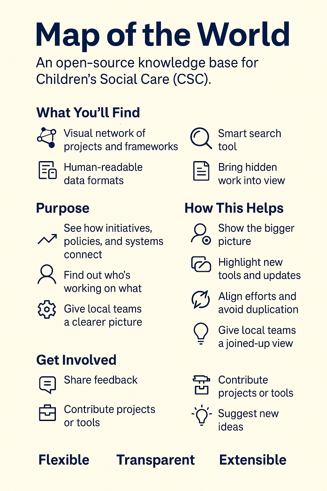

# About this project

Map of the World is an open-source knowledge base for Children’s Social Care (CSC). It brings together key documents, tools, services, and guidance into one structured, searchable map.

## What you’ll find

- A visual network showing how projects, organisations, and frameworks connect  
- A smart search tool for quick access to relevant information  
- Simple, human-readable data formats so anyone can contribute  

The aim is to make the CSC landscape clearer and more connected. Built on open technology, this project is designed to be transparent, flexible, and collaborative, helping the sector work smarter, not harder.

This proof of concept (PoC) forms part of the work toward a Centre of Excellence for CSC, building on thinking behind platforms like the Children’s Services Network and using open modelling approaches such as the Smart City Concept Model. It is designed to be lightweight, transparent, and openly extensible so others can adopt or adapt it for their own contexts.

## Purpose

This PoC is the first step toward creating a clear, searchable map of everything happening in CSC. It will bring together reports, tools, frameworks, guidance, and projects into one place so people can easily find and understand what is out there. We aim to make it simple to:

- See how initiatives, policies, and systems connect  
- Find out who is working on what and track updates  
- Bring hidden or siloed work into view to align efforts and avoid duplication  
- Give local teams a clearer picture of sector-wide activity  

## What’s included

- Published reports and official guidance  
- Data from government and local authority websites  
- Sector-developed tools and frameworks  
- Links to people and organisations (where consent or public information allows)  

All accessible through an intuitive interface with a visual map and search tools.

## Who will use it

Local authority data teams, service managers, researchers, analysts, and project leads working on CSC data or digital delivery. Ultimately, this is a collaborative tool, built with input from local authorities, analysts, service leads, academic partners, and national bodies.

## How this helps

This tool will make life easier across the CSC sector by:

- Showing the bigger picture, clarifying how local and national initiatives, policies, systems, and data sources fit together  
- Highlighting who is doing what, enabling you to track new tools, framework updates, and service changes  
- Bringing hidden work into view, helping teams align efforts, build on progress, and avoid duplication  
- Giving local authority data teams a more joined-up view of sector-wide activity  

## The plan

- **Interactive network map**, explore a live graph showing how entities, relationships, and systems connect across the CSC sector.  
- **Structured data records**, a growing library of YAML files (human-readable format) based on the Smart City Concept Model (SCCM, BSI PAS 182). These describe tools, frameworks, relationships, rules, plans, events, and guidance.  
- **Documentation hub**, technical documentation from Data to Insight (D2I) projects and Git repositories indexed for developers and analysts.  
- **Searchable resource**, a dedicated search page indexing YAML content and files (.md, .pdf, .py, .js, .html) with keyword relevance, match scoring, and metadata extraction.  
- **In development**, currently using a small sample of local authority data (around 10 sites), with plans to expand to all 153 authorities and scrape relevant CSC public sources (.gov, .edu).  

## How it is structured

The tool is built around the Smart City Concept Model (SCCM), an open framework for describing public service ecosystems. Every item in the network diagram is stored as a YAML file, which is simple and easy to edit. Each file starts with a type, for example:

- **AGENT**, people, teams, or organisations  
- **SERVICE**, a system, service, or tool  
- **EVENT**, inspections, launches, or reviews  
- **RULE / PLAN / COLLECTION**, policies, datasets, or strategies  
- **RELATIONSHIP**, links between entities (for example oversight, supply, influence)  

These YAML files are validated, searchable, and easier to edit than formats like JSON or CSV, making contributions simpler.

## How to get involved

This project is being built with the sector, for the sector, and we would welcome your input. You can help by:

- Sharing feedback on what works, what is missing, or what needs fixing  
- Contributing local projects, tools, or documentation  
- Suggesting ideas for how this tool could better support the sector  

To get involved, contact the Data to Insight team or visit our GitHub repository to explore, fork, or contribute.

If you think that this tool might be useful within the sector and want to pass this on to colleagues, feel free to make use of the below infographic that we thought might offer the key headline insights more succintly.

<link rel="prefetch" href="/csc-map-of-the-world/data/graph_data.lite.json" as="fetch" crossorigin>

<link rel="prefetch" href="data/search_index.json" as="fetch" crossorigin>
<link rel="prefetch" href="data/lite_index.json" as="fetch" crossorigin>
<link rel="prefetch" href="data/adjacency.json" as="fetch" crossorigin>

<!-- help CDN connection for cytoscape -->
<link rel="preconnect" href="https://unpkg.com">
<link rel="dns-prefetch" href="https://unpkg.com">

<!-- high priority fetch for next nav target -->
<link rel="preload" href="data/graph_data.lite.json" as="fetch" crossorigin>
<link rel="preload" href="data/degree.json" as="fetch" crossorigin>

<!-- Pre-warm MotW data for whole site -->

